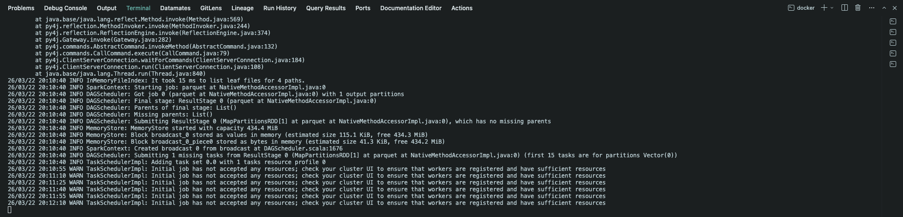
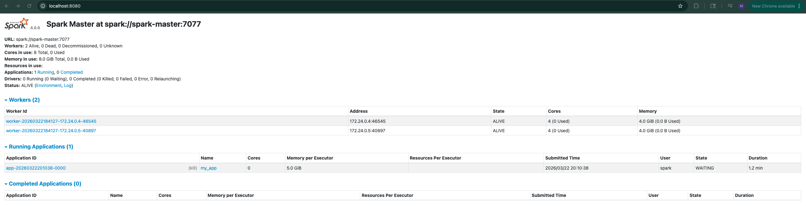

# Running the Application

## 1. Requesting More Resources Than the Cluster Has

Each worker container provides 4 cores and 4GB of RAM. With two workers, the cluster's hard limits are 8 cores and 8GB total.

```text
Cluster capacity:
Worker 1: 4 cores, 4GB     Worker 2: 4 cores, 4GB
───────────────────────     ───────────────────────
Total:    8 cores, 8GB

If your SparkSession requests more than this → allocation fails
```

Requesting more than these limits will result in an error:




---

## 2. RDD and DataFrame

Before we look at memory usage, let's define two key Spark data structures:

```text
┌──────────────────────────────────────────────────────────┐
│  DataFrame                                               │
│  ┌────────────┬────────────┬────────────┬─────────────┐  │
│  │ l_orderkey │ l_partkey  │ l_quantity │ l_shipdate  │  │
│  │ (bigint)   │ (bigint)   │ (bigint)   │ (string)    │  │
│  ├────────────┼────────────┼────────────┼─────────────┤  │
│  │ 1          │ 155190     │ 17         │ 1996-03-13  │  │
│  │ 1          │ 67310      │ 36         │ 1996-04-12  │  │
│  │ ...        │ ...        │ ...        │ ...         │  │
│  └────────────┴────────────┴────────────┴─────────────┘  │
│                                                          │
│  High-level API: named columns, types, SQL-like ops      │
│  Think: distributed SQL table or pandas DataFrame        │
│                                                          │
│  ┌────────────────────────────────────────────────────┐  │
│  │  RDD (Resilient Distributed Dataset)               │  │
│  │                                                    │  │
│  │  Low-level: distributed collection of Java objects │  │
│  │  Every DataFrame operation compiles down to RDDs   │  │
│  │  You rarely use RDDs directly in modern Spark      │  │
│  └────────────────────────────────────────────────────┘  │
└──────────────────────────────────────────────────────────┘
```

| | DataFrame | RDD |
| --- | --- | --- |
| **Abstraction** | Table with named columns and types | Raw collection of objects |
| **API** | `df.groupBy()`, `df.select()`, SQL-like | `rdd.map()`, `rdd.filter()`, functional |
| **Optimization** | Catalyst optimizer + Tungsten engine | No automatic optimization |
| **When to use** | Almost always (modern Spark) | Rarely, only for low-level control |

> In this project, we use DataFrames exclusively. But you'll see "RDD" appear in the Spark UI (e.g., Storage tab) because DataFrames are compiled down to RDDs under the hood.

---

## 3. Data Size in Memory vs On Disk

Parquet files on disk are columnar, compressed, and encoded — all techniques to reduce file size:

- **SNAPPY compression** — a fast compression algorithm developed by Google. It prioritizes speed over compression ratio. Parquet uses SNAPPY by default because Spark needs to decompress data quickly during reads — a slower algorithm like GZIP would save more disk space but slow down processing.
- **Dictionary encoding** — replaces repeated values with short integer codes (e.g., if "TRUCK" appears 1 million times, store it once in a dictionary and reference it by index).
- **Run-length encoding** — compresses consecutive repeated values (e.g., "TRUCK, TRUCK, TRUCK" → "TRUCK × 3").

When Spark reads Parquet into DataFrames, it reverses all of this in two steps:

1. **Decompress** — reverse the SNAPPY compression to get the raw encoded bytes
2. **Deserialize** — convert those bytes into Java objects that Spark can operate on (each object carries overhead: headers, type info, pointers, memory alignment padding)

```text
On Disk (Parquet)              Step 1: Decompress         Step 2: Deserialize
┌─────────────────────┐       ┌─────────────────────┐    ┌──────────────────────────┐
│ SNAPPY compressed   │       │ Raw encoded bytes   │    │ Java objects in memory   │
│ Dictionary encoded  │ ────► │ Dictionary decoded  │ ──►│ Object headers (16 bytes)│
│ Run-length encoded  │       │ Run-length expanded │    │ Pointers for each field  │
│                     │       │                     │    │ Memory alignment padding │
│ ~10.4 GB            │       │                     │    │ ~11.3 GB                 │
└─────────────────────┘       └─────────────────────┘    └──────────────────────────┘
```

---

### 3.1 Observing this with caching

To see the real memory usage, we can **cache** the DataFrame and check the Storage tab in the Spark History UI.

**Caching** stores the contents of a DataFrame in memory (or disk) of worker nodes so executors can quickly access it for subsequent operations without re-computing.

```text
Without cache:                         With cache:
read parquet ──► groupBy ──► show      read parquet ──► stored in memory
read parquet ──► filter  ──► show                       ├──► groupBy ──► show
     ↑ reads from disk twice                            └──► filter  ──► show
                                                         ↑ reads from memory
```

> `cache()` is a lazy transformation — it only marks the DataFrame for caching. We need an action like `count()` to actually trigger it.

To test this, adjust `main.py` to:

1. Read all 4 parquet files
2. Cache the DataFrame
3. Call `count()` to trigger the cache
4. Comment out the aggregation logic

```bash
docker exec -it spark-master /opt/spark/bin/spark-submit \
  --master spark://spark-master:7077 \
  /opt/spark/work-dir/spark-warehouse/data/main.py
```

After that, visit the Spark History Server (localhost:18080), choose your application, and switch to the Storage tab.

---

### 3.2 What the numbers show

```text
Parquet on disk:     ~10.4 GB  (4 files × 2.6 GB)

Spark Storage tab:
├── Size in Memory:    1.3 GB  (fits in executor heap)
├── Size on Disk:     10.0 GB  (spilled to local filesystem)
└── Total cached:    ~11.3 GB  (deserialized size)
```

The deserialized data (~11.3 GB) is larger than the original parquet (~10.4 GB) because Spark has to decompress and expand the data into full Java objects.

```text
Why most data spills to disk:

Executor 1 (2 GB heap)              Executor 2 (2 GB heap)
┌──────────────────────┐           ┌──────────────────────┐
│ ┌──────────────────┐ │           │ ┌──────────────────┐ │
│ │ Cached in memory │ │           │ │ Cached in memory │ │
│ │ (~650 MB)        │ │           │ │ (~650 MB)        │ │
│ ├──────────────────┤ │           │ ├──────────────────┤ │
│ │ JVM overhead,    │ │           │ │ JVM overhead,    │ │
│ │ execution memory │ │           │ │ execution memory │ │
│ └──────────────────┘ │           │ └──────────────────┘ │
└──────────┬───────────┘           └──────────┬───────────┘
           │                                  │
           ▼                                  ▼
   Spill to local disk                Spill to local disk
   (~5 GB each)                       (~5 GB each)
```

With only 2 executors × 2 GB each (~4 GB total, minus JVM overhead), most of the 11.3 GB doesn't fit in memory and spills to the local filesystem.

> The "Size on Disk" column in the Storage tab refers to the container's **local filesystem**, not executor RAM. This is limited by the host's available disk space, not the 8 GB Docker memory limit.

---

### 3.3 Key takeaway

The deserialized data size in Spark can differ significantly from the on-disk Parquet size. Depending on data types and compression ratio, it can be substantially larger — never assume they are equal when planning executor memory. We will revisit this point later.
